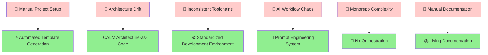
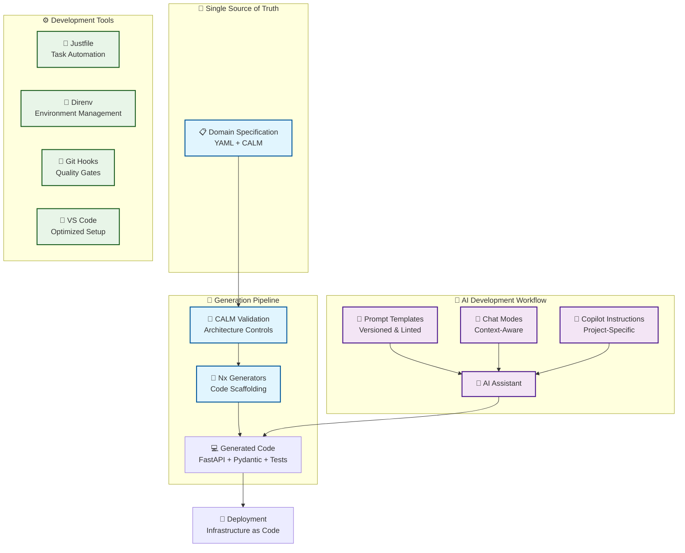
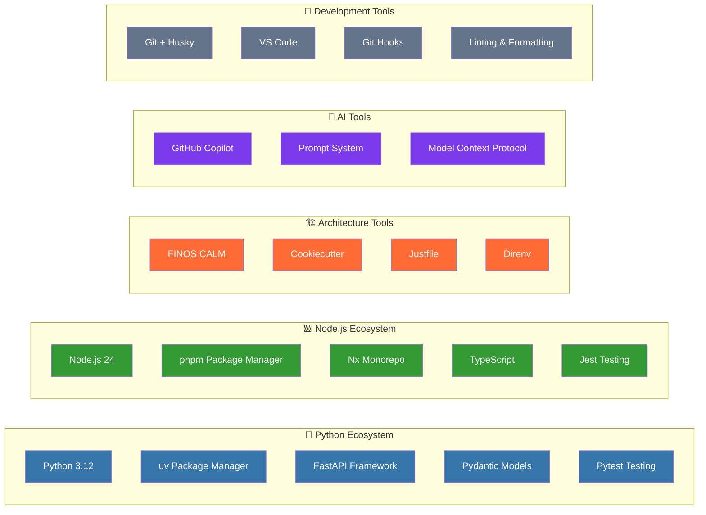

# 🚀 VibePDK

[](https://opensource.org/licenses/MPL-2.0)
[](https://github.com/SPRIME01/VibePDK/actions/workflows/node-tests.yml)
[](https://github.com/audreyr/cookiecutter)

> **AI-Native Development Kit** for building scalable, architecture-driven applications with automated code generation, prompt engineering workflows, and enterprise-grade tooling.

## 🎯 What VibePDK Solves

VibePDK eliminates the most common pain points in modern software development:



## 🏗️ Architecture Overview

VibePDK creates a comprehensive development ecosystem that scales from startup to enterprise:



## ✨ Key Features

### 🧭 **Architecture-as-Code with CALM**

- **[FINOS CALM](https://github.com/finos/architecture-as-code)** integration for enterprise-grade architecture governance
- **Automated validation** of architectural constraints and patterns
- **Visual topology** generation from code specifications
- **Deployment metadata** managed alongside application logic

### 🚦 **Nx Monorepo Orchestration**

- **Smart caching** and **dependency graph analysis**
- **Incremental builds** and **affected testing**
- **Code sharing** across polyglot services
- **Workspace generators** for consistent scaffolding

### 🤖 **AI-Native Development Workflow**

- **Prompt engineering system** with versioning and linting
- **Context-aware chat modes** for different development phases
- **GitHub Copilot integration** with project-specific instructions
- **Automated code generation** with specification-driven prompts

### 🐍 **Python + Node.js Ecosystem**

- **FastAPI + Pydantic** scaffolding with `@nxlv/python`
- **Modern Python tooling**: `uv` for package management
- **TypeScript support** with strict typing
- **Cross-platform compatibility** via `justfile`

### 📚 **Living Documentation**

- **Specification-driven development** with TDD workflows
- **Automated docs generation** from architecture and code
- **Traceability matrix** linking requirements to implementation
- **Knowledge management** with structured prompt libraries

## 🛠️ Technology Stack



## 🚀 Quick Start

### Prerequisites

Ensure you have the following installed:

```bash
# Required
Python 3.12+         # pyenv recommended
Node.js 24+          # Volta recommended
cookiecutter         # uv tool install cookiecutter
direnv              # Environment management

# Optional but recommended
just                # Task runner
git                 # Version control
```

### 1️⃣ Generate Your Project

```bash
# Clone the template
git clone https://github.com/SPRIME01/VibePDK.git
cd VibePDK

# Generate a new project
cookiecutter .

# Follow the prompts:
# project_slug: my-awesome-app
# author_name: Your Name
# python_version: 3.12
# description: My revolutionary application
```

### 2️⃣ Set Up Development Environment

```bash
# Navigate to your new project
cd my-awesome-app

# Load environment variables
direnv allow

# Install toolchains (if using Volta)
volta pin node@24 pnpm@latest
corepack enable && corepack prepare pnpm@latest --activate

# Install dependencies
pnpm install
```

### 3️⃣ Start Building

```bash
# Generate domain inputs from CALM architecture
just gen-calm

# Scaffold your first service
just nx-generate

# Run tests to verify setup
just test

# Start development server (when implemented)
just dev
```

## 📋 Common Workflows

### 🏗️ **Architecture-First Development**

```bash
# 1. Define architecture in CALM
edit architecture/calm/system.calm.json

# 2. Generate domain model
just gen-calm

# 3. Validate architecture constraints
just calm-validate

# 4. Scaffold services from architecture
just nx-generate
```

### 🤖 **AI-Assisted Development**

```bash
# 1. Review available prompt templates
ls .github/prompts/

# 2. Lint prompts for consistency
just prompt:lint

# 3. Use context-aware chat modes in VS Code
# Open Command Palette → GitHub Copilot: Chat

# 4. Generate code with specification prompts
just ai:scaffold type=api name=users
```

### 🔄 **Specification-Driven TDD**

```bash
# 1. Create feature specification
just spec:feature name=user-management

# 2. Generate implementation plan
just spec:plan feature=user-management

# 3. Break down into tasks
just spec:tasks feature=user-management

# 4. Implement with TDD cycles
just tdd:cycle feature=user-management
```

## 🗂️ Generated Project Structure

VibePDK creates a comprehensive project layout:

```text
my-awesome-app/
├── 🏗️ architecture/           # CALM architecture definitions
│   └── calm/
│       ├── system.calm.json   # System topology
│       └── patterns.calm.json # Reusable patterns
├── 🎯 domain/                 # Domain model specification
│   └── domain.yaml           # Single source of truth
├── ⚙️ generators/             # Nx workspace generators
│   ├── nx/                   # Standard Nx generators
│   └── nxlv-python/          # Python-specific generators
├── 🧰 tools/                  # Development utilities
│   ├── calm/                 # Architecture validation
│   ├── prompt/               # AI prompt management
│   ├── spec/                 # Specification tools
│   └── test/                 # Testing utilities
├── 📱 apps/                   # Application projects
├── 📚 libs/                   # Shared libraries
├── 🤖 .github/                # AI workflow integration
│   ├── prompts/              # Versioned prompt templates
│   ├── chatmodes/            # Context-aware chat modes
│   ├── instructions/         # Copilot configuration
│   └── workflows/            # CI/CD automation
├── 🎨 .vscode/                # Optimized IDE setup
│   ├── settings.json         # Project settings
│   ├── tasks.json            # Task definitions
│   └── mcp.json              # Model Context Protocol
├── 📋 justfile                # Cross-platform task runner
├── 🔧 .envrc                  # Environment configuration
├── 📦 package.json            # Node.js dependencies
├── 🐍 requirements.txt        # Python dependencies
└── 🌐 techstack.yaml          # Technology stack definition
```

## 🎯 Use Cases

### 🏢 **Enterprise Applications**

- **Microservices architecture** with CALM governance
- **Compliance and audit trails** through architecture-as-code
- **Cross-team collaboration** with standardized workflows
- **Technology stack standardization** across departments

### 🚀 **Startup MVPs**

- **Rapid prototyping** with pre-configured generators
- **AI-accelerated development** through prompt engineering
- **Scalable foundation** that grows with your team
- **Best practices by default** without over-engineering

### 🔬 **Research & Innovation**

- **Experiment tracking** through specification versioning
- **Reproducible environments** with declarative tooling
- **AI-assisted exploration** with context-aware prompts
- **Knowledge capture** through living documentation

### 🎓 **Educational Projects**

- **Learn modern development practices** through working examples
- **Understand architecture patterns** with visual CALM diagrams
- **Practice TDD workflows** with guided specifications
- **AI pair programming** with structured prompts

## 🛡️ Best Practices

### 🔒 **Security & Secrets Management**

```bash
# Never commit secrets - use environment files
echo "SECRET_KEY=your-secret" >> .envrc.local

# Use secret managers in production
export DATABASE_URL="$(vault kv get -field=url secret/database)"

# Validate security with automated scans
just security:scan
```

### 📐 **Architecture Governance**

```bash
# Validate architectural constraints
just calm:validate

# Generate architecture diagrams
just calm:diagram

# Check for architecture drift
just calm:drift-check
```

### 🤖 **AI Development Workflow**

```bash
# Lint prompts for consistency
just prompt:lint

# Preview prompt outputs before commit
just prompt:preview

# Version prompts with semantic releases
just prompt:release
```

### 🔄 **Continuous Integration**

```yaml
# .github/workflows/ci.yml
name: CI Pipeline
on: [push, pull_request]
jobs:
  test:
    runs-on: ubuntu-latest
    steps:
      - uses: actions/checkout@v4
      - run: just install
      - run: just lint
      - run: just test
      - run: just calm:validate
      - run: just prompt:lint
```

## 🔧 Advanced Configuration

### 🎨 **Customizing Generators**

```typescript
// generators/my-custom/index.ts
import { Tree, formatFiles, generateFiles } from '@nx/devkit';

export default async function(tree: Tree, options: any) {
  generateFiles(tree, path.join(__dirname, 'files'), '.', options);
  await formatFiles(tree);
}
```

### 🧭 **Extending CALM Patterns**

```json
{
  "calm": "1.0.0",
  "patterns": {
    "api-gateway": {
      "type": "pattern",
      "description": "Standard API Gateway configuration",
      "components": ["gateway", "load-balancer", "rate-limiter"]
    }
  }
}
```

### 🤖 **Custom Prompt Templates**

```markdown
---
thread: feature-implementation
matrix_ids: [SDS-001, PRD-002]
---

# Feature Implementation Prompt

## Context
You are implementing {{feature_name}} based on the specification.

## Requirements
{{requirements}}

## Constraints
{{constraints}}

## Expected Output
- Implementation plan
- Test strategy
- Documentation updates
```

## 🚨 Troubleshooting

### Common Issues

<details>
<summary>🐍 <strong>Python Environment Issues</strong></summary>

```bash
# Issue: Python version mismatch
# Solution: Use pyenv to manage Python versions
pyenv install 3.12.11
pyenv local 3.12.11

# Issue: uv not found
# Solution: Install uv package manager
curl -LsSf https://astral.sh/uv/install.sh | sh

# Issue: Dependencies not installing
# Solution: Clear cache and reinstall
uv cache clean
uv pip install -r requirements.txt
```

</details>

<details>
<summary>🟨 <strong>Node.js & pnpm Issues</strong></summary>

```bash
# Issue: pnpm not found
# Solution: Enable corepack
corepack enable
corepack prepare pnpm@latest --activate

# Issue: Node version mismatch
# Solution: Use Volta for version management
volta install node@24
volta pin node@24

# Issue: Nx cache corruption
# Solution: Clear Nx cache
pnpm exec nx reset
```

</details>

<details>
<summary>🧭 <strong>CALM Validation Errors</strong></summary>

```bash
# Issue: CALM schema validation failed
# Solution: Check schema format
just calm:validate --verbose

# Issue: Missing architecture files
# Solution: Generate from template
just calm:init

# Issue: Circular dependencies detected
# Solution: Review architecture graph
just calm:graph
```

</details>

<details>
<summary>🤖 <strong>AI Workflow Issues</strong></summary>

```bash
# Issue: Prompts failing validation
# Solution: Run linter and fix issues
just prompt:lint --fix

# Issue: Context not loading in Copilot
# Solution: Reload VS Code window
# Command Palette → "Developer: Reload Window"

# Issue: MCP server not connecting
# Solution: Check server configuration
cat .vscode/mcp.json
```

</details>

## 🤝 Contributing

We welcome contributions! Please see our [Contributing Guide](CONTRIBUTING.md) for details.

### Development Setup

```bash
git clone https://github.com/SPRIME01/VibePDK.git
cd VibePDK
uv sync --dev
pre-commit install
```

### Running Tests

```bash
# Run all tests
uv run pytest

# Test template generation
uv run pytest tests/test_cookiecutter_generation.py

# Test specific components
uv run pytest tests/test_pre_gen_project.py -v
```

## 📄 License

This project is licensed under the [Mozilla Public License 2.0](LICENSE) - see the LICENSE file for details.

## 🙏 Acknowledgments

- **[FINOS CALM](https://github.com/finos/architecture-as-code)** - Architecture-as-code specification
- **[Nx](https://nx.dev/)** - Monorepo orchestration platform
- **[Cookiecutter](https://github.com/audreyr/cookiecutter)** - Project templating system
- **[@nxlv/python](https://www.npmjs.com/package/@nxlv/python)** - Python workspace integration
- **[GitHub Copilot](https://github.com/features/copilot)** - AI pair programming

---

<div align="center">

**[⭐ Star this repo](https://github.com/SPRIME01/VibePDK) if VibePDK helps accelerate your development!**

[](https://github.com/SPRIME01/VibePDK/stargazers)
[](https://github.com/SPRIME01/VibePDK/network/members)

</div>
